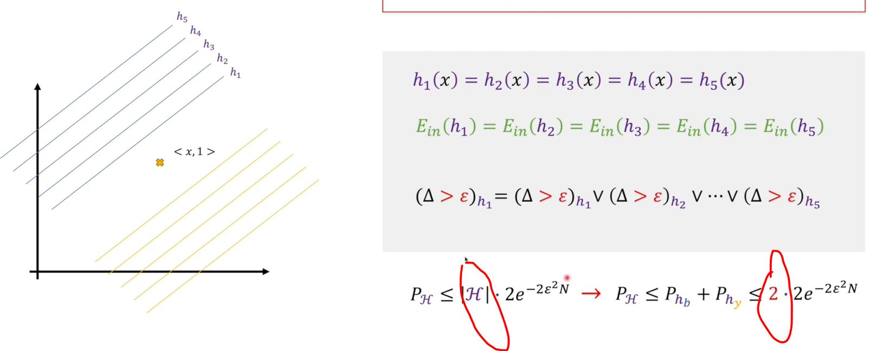

{:toc}

# Statistical Basis 

Markov inequality: if a random variable X has expectation of k moment $$E|X|^k$$, go the theorm for each positive number $$\epsilon$$:
$$
P\{|X|\ge\epsilon\}\le\frac{E|X|^k}{\epsilon^k}
$$
Proof:
$$
P\{|X|\ge\epsilon\}=\int_{|x|\ge\epsilon}f(x)dx
\\\le\int_{|x|\ge\epsilon}\frac{|x|^k}{\epsilon^k}f(x)dx
\\\le\frac1{\epsilon^k}\int_{-\infty}^{+\infty}|x|^kf(x)dx
\\=\frac{E|X|^k}{\epsilon^k}
$$
bring in $$X=X-EX$$, k=2, we can get Chebyshev inequality.

Khinchine's law of large numbers: for i.i.d. random variable $$X_1,X_2, ...,X_n$$, if they have a limited expectation $$EX_i=\mu$$, then
$$
\lim_{n\rightarrow\infty}P\{|\bar X-\mu|<\epsilon\}=1
$$
where $$\bar X=\frac1n\sum_{i=1}^nX_i$$,  $$\epsilon$$ is a number small enough.

Hoeffding inequality (can be deduced from Khinchine's law): for n independent random variables $$X_1,X_2,...,X_n$$, and $$0\le X_i\le1$$, then $$\forall \epsilon \gt0$$,
$$
P\{|\frac1n\sum_{i=1}^{n}X_i-\frac1m\sum_{i=1}^nE(X_i)|\ge\epsilon\}\le2e^{-2n\epsilon^2}
$$
if random variables $$x_1,x_2,...,x_n$$ are i.i.d, this inequality can be simplified as 
$$
P\{|\bar X-\mu|\ge\epsilon\}\le2e^{-2n\epsilon^2}
$$

# Terminology

- concept (c): a mapping between sample space $$\mathscr X$$ and label space $$\mathscr y$$. If it correctly mapping the true relationship (i.e. for any sample $$(X,y)$$, $$c(x)= y$$), c will be dubbed as a objective concept. All of the objective concept cluster into a concept class $$\mathscr C$$.

- hypothesis: a hypothesis space $$\mathscr H$$ includes all concepts provided by certain algorithms and models. a hypothesis h belongs to $$\mathscr H$$. Because hypothesis is made up by predefined models and algorithms, our goal is to make those hypothesis as close to objective concept as we can.

  we assume the true concept (relationship) we want to learn is $$G$$, for any sample $$(x,y)$$, $$y=G(x)$$.

- Version space: the set of all hypo $$h\in \mathscr H$$ that correctly classify all training samples of $$\mathscr D$$.

- training error (Ein,  $$error_S(h)$$, 经验误差): given a specific sample set (dataset) $$\mathscr D$$ which has n samples, training error is 
  $$
  \hat E(h;\mathscr D)=E_{in}(h;\mathscr D)=\frac1n\sum_{i=1}^n[h(x_i)\neq y_i]
  $$
  two key factors for training error: first, training error is the only factor we can calculate and optimize. we cannot observe true error, because it's a theoratical thing, we do not have infinite sample set. second, training error is highly relevant to how we choose our sample set, which will be useful in later deduction.

- true error (Eout, $$error_D(h)$$, 泛化误差): 
  $$
  E(h;G)=E_{out}(h;G)=P_{\forall x \;obey\; G}\{h(x)\neq y\}
  $$
  true error is no longer relevant to sample set D; the only decisive factor is the hypothesis h. 

- PAC identifiable: if we can wisely choose a hypothesis h from $$\mathscr H$$ to meet the following condition:
  $$
  P\{E(h;G)\le\epsilon\}\ge1-\delta,\;(0<\epsilon,\delta<1)
  $$
  we call from $$\mathscr H$$ to identify G is PAC identifiable.

# Simple occasions

now we consider a simplest condition: hypo space $$\mathscr H$$ is finite, and the objective concept is just in the set $$\mathscr H$$. Because objective concept perfectly seperates each samples, any hypo that makes mistakes on a finite sample set $$\mathscr H$$ won't be the ideal concept. So in this simple assumption, we only need to choose one hypo among those hypo perfectly works on $$\mathscr H$$.

according to the definition of PAC identifiable, we only need to ensure that the event "the dedicatedly chosen hypo h from whole set of $$\mathscr H$$, has a error rate more than $$\epsilon$$", happens in a probability less than $$\delta$$. Sorta complicated. But it'll become clear with some examples. We assume $$h_1, h_2, ...,h_k$$ are the only k hypos has a true error more than $$\epsilon$$. 

For each one in those k hypos, the possibility that it works correct on every sample of $$\mathscr D$$ is less than $$(1-\epsilon)^n$$, where n is how many samples in set $$\mathscr D$$. The possibility that at least one hypo has no training error and has true error more than $$\epsilon$$ is less than:
$$
k(1-\epsilon)^n
$$
k < $$|\mathscr H|$$, so we can find a upper boundary for it:
$$
P\{h\in \mathscr H;E_{out}(h,\mathscr D)>\epsilon \and E_{in}(h)=0\}<k(1-\epsilon)^n\\\le|\mathscr H|(1-\epsilon)^n\le|\mathscr H|e^{-n\epsilon}
$$
 In this case, we can learn that if we add n until $$|\mathscr H|e^{-n\epsilon}\le\delta$$, this problem will be PAC identifiable. 
$$
|\mathscr H|e^{-n\epsilon}\le\delta
\\n\ge\frac1\epsilon(\ln |\mathscr H|+\ln(\frac1\delta))
$$
then we come to the conclusion: if we have more than $$\frac1\epsilon(\ln |\mathscr H|+\ln(\frac1\delta))$$ samples, and our hypo space is defined in a proper way (hypo space includes the objective concept), the problem will be PAC identifiable--in another word, it can be solved by machine learning. 

# Complicated occasions

for most occasions, we do not have an perfect objective concept to learn, due to random noises. but in this time, luckily the training error and true error can serve as two components in Hoeffding inequality. Suppose another discrete random variable X: given a hypothesis h, randomly select a sample (x,y), then observe whether h(x) is equal to objective concept c(x)=y. if yes, X=1; otherwise X=0. To fit it in Hoeffding inequality, we write a formula below:

$$
P\{|E_{in}(h;\mathscr D)-E_{out}(h)|\ge\epsilon\}\le2e^{-2n\epsilon^2}
$$
this inequality are supposed to be powerful. but as for a certain h, we cannot say with any certainty that how good h is, even if we have already reduced Ein to its least. Because there is still another variable, $$\mathscr D$$. We can only know the upper bound, instead of an explicit number.

But if we turn to a hypo space, this problem can be partly solved. For a whole hypo set $$\mathscr H$$, 
$$
P\{\exist h\in\mathscr H, s.t.|E_{in}(h;\mathscr D)-E_{out}(h)|>\epsilon\}

\\=P\{|E_{in}(h_1;\mathscr D)-E_{out}(h_1)|>\epsilon\\\or|E_{in}(h_2;\mathscr D)-E_{out}(h_2)|>\epsilon\\\or...\or|E_{in}(h_{m_\mathscr H(n)};\mathscr D)-E_{out}(h_{m_\mathscr H(n)})|>\epsilon\}

\\\le P\{|E_{in}(h_1;\mathscr D)-E_{out}(h_1)|>\epsilon\}\\+ P\{|E_{in}(h_2;\mathscr D)-E_{out}(h_2)|>\epsilon\}\\+...+ P\{|E_{in}(h_{m_\mathscr H(n)};\mathscr D)-E_{out}(h_{m_\mathscr H(n)})|>\epsilon\}
\\\le2m_\mathscr H(N)e^{-2n\epsilon^2}
$$
where $$m_\mathscr H(n)$$ refers to the effective hypos in hypo set $$\mathscr H$$, n is $$|\mathscr D|$$. there's an example below:

# Growth function and VC dimension

actually, aforementioned $$m_\mathscr H(n)$$ has another name: growth function. given n samples, how many different hypothesis is in hypo set $$\mathscr H$$? the growth function gives it an answer. 

the VC dimension of an infinite hypo set $$\mathscr H$$ is defined as below (for a binary classification):
$$
VC(\mathscr H)=max\{n|m_\mathscr H(n)=2^n\}
$$
VC dimension measures the ability of $$\mathscr H$$ to imitate other functions. 

it can be proven by mathematical induction that
$$
m_\mathscr H(n)\le\sum_{i=0}^{VC(\mathscr H)}(\begin{matrix}n\\i\end{matrix})\le(\frac{ne}{VC(\mathscr H)})^{VC(\mathscr H)}
$$

# Reference

[王木头讲科学](https://www.bilibili.com/video/BV1Nr4y1i7or/?spm_id_from=333.788&vd_source=b03897216ce330061ff8a340759a0776)

机器学习 周志华 清华大学出版社
