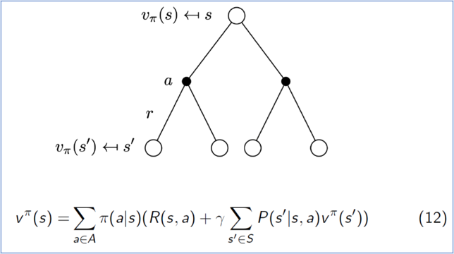
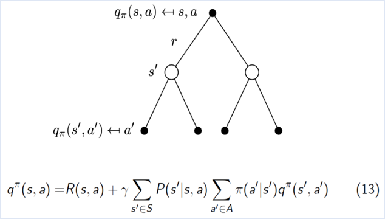

{:toc}

# Basic Definition

Concept: Markov Process + Reward + Decision

MDP is a tuple $$(S,A,P,R,\gamma)$$

- S is a finite set of states

- A is a finite set of actions

- P stands for the possibility of state transition: 

  $$P^a=P(s_{t+1}=s'|s_t=s,a_t=a)$$

- R is an expectation of immediate state's reward: 

  $$R(s_t=s,a_t=a)=E[r_t|s_t=s,a_t=a]$$

- $$\gamma$$ is discount factor, $$0\le\gamma\le1$$

Policy: $$\pi(a|s)=P(a_t=a|s_t=s)$$, which is the main factor can be modified and improved

Based on policy, a statistic mixture of actions, P and R can be rewritten as follow:
$$
P^\pi(s_{t+1}=s'|s_t=s)=\sum_{a\in A}\pi(a|s)P(s_{t+1}=s'|s_t=s,a_t=a)
\\R^\pi(s_t=s)=\sum_{a\in A}\pi(a|s)R(s_t=s,a_t=a)
$$

# Value function

Compared with the aforementioned reward function $$R(s_t=s,a_t=a)$$, the following ocncepts are based on a certain policy $$\pi(a|s)$$.

## State-value function  $$v^\pi(s)$$

$$
v^\pi(s)=E_\pi[r_t|s_t=s]
$$

state-value function can also be calculated recursively:
$$
v^\pi(s)=E_\pi[R_{t+1}+\gamma v^\pi(s_{t+1})|s_t=s]
$$
where $$R_{t+1}=R(s_t=s,a_t=a)$$,

$$E_\pi(R_{t+1}|s_t=s)=\sum_{a\in A}\pi(a|s)R(s,a)$$,

$$E_\pi(R_{t+1}|s_t=s,a_t=a)=R(s,a)$$.

## Action-value function  $$q^\pi(s,a)$$

$$
q^\pi(s,a)=E_\pi[r_t|s_t=s,a_t=a]
$$

Likewise, q also has a recursive calculating method:
$$
q^\pi(s,a)=E_\pi[R_{t+1}+\gamma q^\pi(s_{t+1},a_{t+1})|s_t=s,a_t=a]
$$
Action-value function is quite similar with the reward function. The relation between state-value function and action-value function:
$$
v^\pi(s)=\sum_{a\in A}\pi(a|s)q^\pi(s,a)
$$

# Optimal methods

## policy method

Policy evaluation + Optimal value function

policy evaluation: given a policy $$\pi(a|s)$$, calculate state-value function $$v^\pi(s)$$ for each state s by iteration until it reaches a convergence.
$$
v^\pi(s)\leftarrow\sum_{s'}P^\pi(s_{t+1}=s'|s_t=s)·[r_s+\gamma v^\pi(s')]
$$
optimal value function: for each state s, according to state-value function $$v^\pi(s')$$ , immediate reward $$r_s$$, and markov transition probability $$p(s',r|s,a)$$, choose an action a* that optimizes the total reward at state s. Make policy $$\pi(a|s)$$ equal to the optimal action a*.
$$
\pi(a|s)\leftarrow arg\max_a\sum_{s'}P(s_{t+1}=s'|s_t=s,a_t=a)·[r_s+\gamma v^\pi(s')]
$$
Those two steps are implemented in turn until the policy reaches a convergence.

## value method

Setting apart the policy evaluation and optimization of value function is redundant. To combine those two process together, we can use value iteration:
$$
v^\pi(s)\leftarrow\max_a\sum_{s'}P(s_{t+1}=s'|s_t=s,a_t=a)·[r_s+\gamma v^\pi(s')]
$$
after adequate iteration, we get a optimal value function $$v^*$$. then what we should do is just use $$v^*$$ to deduce optimal policy $$\pi^*$$, which only takes one step:
$$
\pi^*(a|s)=arg\max_a\sum_{s'}P(s_{t+1}=s'|s_t=s,a_t=a)·[r_s+\gamma v^\pi(s')]
$$
