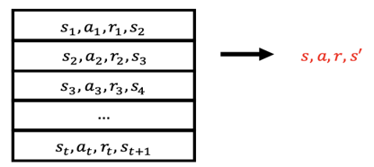
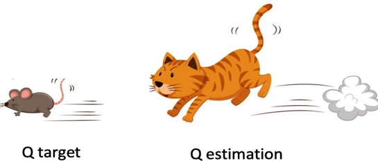

{:toc}

# Q-learning

==TODO: Q learning introduction==

Basic Q-learning is tabular based, which uses lots of space to encode the relationship between state information and the chosen action. What if we introduce some other complicated methods to replace for our Q table?

# Neural Networks

neural networks are an ideal tool to build a function between an image-like input and a sparse output. What's more, compared with other linear approximator, neural networks are non-linear, which means they have greater potential to represent rich information.

However, if we introduce Deep Neural Networks (DNN) as Q-function (approximator for policy function and value function), some problems kick in: first, usually DNNs have too many parameters to optimize; second, DNN + RL brings much more uncertainties for training and end up with divergence. 

The second problem could be partly addressed by following tricks:

## Experience replay

one of the most important factors causing divergence of RL is Temporal Difference. Although it is an efficient way to update agent's policy, it also brings bias due to its local focus. In addition, DNNs need i.i.d. data to have best training, avoiding correlations between samples. To address these, we introduce experience replay mechanism as follow steps:

1. initialize a replay buffer, each element contains a collection of experience tuples (S, A, R, S′). 

2. The tuples are gradually added to the buffer as the agent is interacting with the Environment. 

3. a buffer is of a fixed size, with new data added to the end of the buffer so that it pushes the oldest experience out of it.

4. when learning the DNN, sample an experience tuple from the dataset (i.e. replay buffer), and use stochastic gradient decend (SGD) to update DNN.

   

while learning the network by SGD, the gradient would be the difference between (real word reward+target net estimation-Q^) and eval net estimation-Q. That's an off-policy Q learning.

Δ**w**=α(r+γ max┬(a^′ ) Q ˆ(s^′,a^′,**w)**-Q(s,a,**w**)) ∇_**w** Q(s,a,**w**)

one more merit brought by experience replay: it allows us to learn more from individual tuples multiple times, recall rare occurrences, and in general make better use of our experience.

## fixed target

if evaluate net and target net are both updating during DQN learning (similar with on-policy), evaluate net will update literally everywhere, causing **oscillated** **training**. Therefore, we fix target net for a number of epochs, and we update target net once per all epochs. In those fixed epochs, target is used to estimate future value and update evaluate net. 

## Overview

DQN process can be expressed by a pseudo code below:

- initialize replay buffer D and its contain N

- initialize eval_net() and target_net()

- **for** episode = 1, M **do**

  - **if** M divides a certain number $$\epsilon$$，update target_net() as current eval_net()

  - initialize the world and get ready to interact with the world

  - **while** game is not ended

    - choose an action via epsilon-greedy according to the result of eval_net(state)，obtain the chosen action
    - interact with the environment，get a tuple (S, A, R, S′)
    - store (S, A, R, S′) into replay buffer
    - **if** replay buffer has more than N element：
      - randomly choose a batch of experience record from D
      - learn eval_net() via SGD according to the chosen batch of experience

    - update state.
